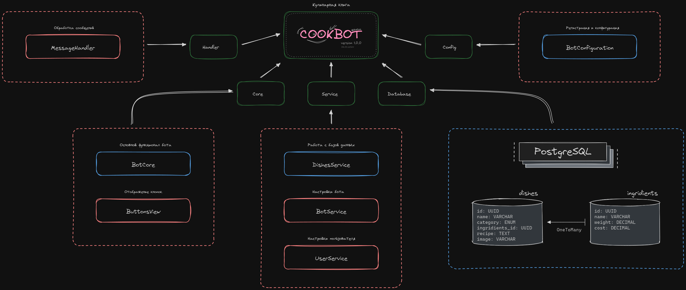

# 

### Документация

[TelegramAPI](https://core.telegram.org/api)

 Телеграм бот @upravaDCookBot представляет собой кулинарную книгу, 
где пользователь может добавить или посмотреть рецепты, 
которые распределены по категориям. 

---

##### [`RoadMap`](https://excalidraw.com/#json=6KQLA57IucvT2vDmGJ-ai,RB7ALI8H2mQoNinbvZcFyQ)

---

##### `Локальный запуск`

- Скачать проект (fork)
- Запустить docker-compose
- Собрать проект (build)
- Запустить проект (main)

---

##### `Основные методы`

- Добавить рецепт
- Выбрать рецепт

---
